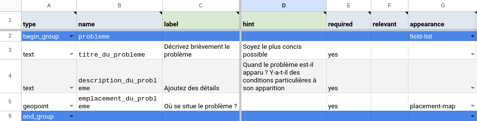
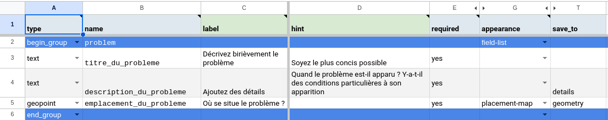
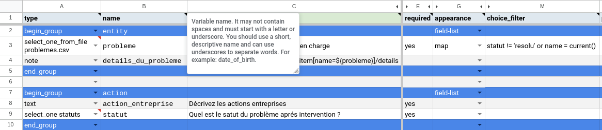

:orphan:
:og:image: https://docs.getodk.org/_static/img/tutorial-community-reporting-fr.png

Tutoriel sur les Entités : Signalements de problèmes
====================================================

.. article-info::
    :avatar: /img/authors/mathieu.jpg
    :avatar-link: https://www.cen-occitanie.org/
    :avatar-outline: muted
    :author: Mathieu Bossaert, CEN Occitanie
    :date: 5 avril 2024

:bdg-success:`traduction contribuée`

De nombreuses organisations utilisent des formulaires pour recueillir des informations de la part de leurs communautés.

Par exemple :

* des municipalités demandant à leurs habitants de signaler les lampadaires cassés, les arbres tombés, les trous dans la chaussée, etc.
* des services publiques demandant à leurs bénéficiaires les problèmes rencontrés et ce qui pourrait être amélioré.

Dans ce tutoriel, vous utiliserez le concept d'**entités** pour mettre en place un flux de travail dans lequel les habitants d'une ville signalent des problèmes, que les employés municipaux peuvent ainsi résoudre.

.. seealso::
   * `Vidéo des coulisses <https://youtu.be/919SIU41UQA>`_ du développement de ce tutoriel.
   * :doc:`Introduction aux entités <../../central-entities>`
   * 🇬🇧 :doc:`Original en anglais <../../tutorial-community-reporting>`

.. note::
   Seul ce tutoriel a été traduit en français, le reste de la documentation est présentement en anglais.
   
Objectifs
---------
* Créer des entités à partir de soumissions de formulaires
* Accéder aux entités dans un formulaire de suivi
* Mettre à jour des entités à partir de soumissions de formulaires

.. _tutoriel-entites-signalement-probleme:

Saisir les signalements de problèmes à l'aide d'un formulaire simple
--------------------------------------------------------------------
  
.. seealso::
  Si vous n'avez pas encore l'habitude de construire des formulaires XLSForms, commencez par :doc:`le tutoriel XLSForm <../../xlsform-first-form>`.

Un formulaire de signalement peut être très simple. Pour que les employés municipaux puissent trouver et résoudre les problèmes signalés, il suffit de saisir un titre, une description du problème et le lieu ou il est rencontré. Pour cela, vous pouvez créer votre propre formulaire ou `utiliser notre exemple <https://docs.google.com/spreadsheets/d/15pb3gyQ38T11IMlP4CJxW6r-3g_3Q54-Zj_6m5EZgpA>`_.

Vous pourriez vous arrêter ici et construire une chaine de traitements autour de ce simple formulaire. Par exemple, vous pourriez publier le formulaire avec un lien d'accès public :ref:`Lien d'Accès Public <central-submissions-public-link>`, créer un QR code contenant ce lien (en utilisant un service comme `celui d'Adobe <https://new.express.adobe.com/tools/generate-qr-code>`_), et l'afficher dans l'espace public afin que les habitants s'en servent. Alors les employés municipaux pourront :ref:`afficher les soumissions du formulaire dans Excel <central-submissions-odata>` et ajouter une colonne dans une feuille de calcul partagée pour gérer la résolution des nouveaux problèmes.

Cette approche nécessite des interventions manuelles et de la coordination avec une feuille de calcul, pouvant être source d'erreur et chronophages. Utilisons plutôt les entités d'ODK pour faciliter la gestion des problèmes en temps réel.

Créer une entité pour chaque problème signalé
-----------------------------------------------

Nous aimerions que les signalements soient disponibles dans un autre formulaire afin que les employés municipaux puissent les prendre en charge et résoudre les problèmes.
Pour cela dans ODK, nous pouvons utiliser les entités.
Une entité représente un objet unique qui peut être partagé entre différents formulaires (voir :doc:`../../central-entities`).

Démarrons en prenant notre formulaire :ref:`Signaler un problème <tutoriel-entites-signalement-probleme>` existant et faisons lui créer des Entités qui représenteront les problèmes signalés.

#. Ouvrez ou créez la feuille ``entities`` dans le formualire ``Signaler un problème``.
#. Dans la colonne ``list_name``, entrez le nom de la Liste d'Entités dans laquelle vous souhaitez créer des Entités : ``problemes``. Ce nom sera généralement un nom pluriel représentant une collection des objets que vous souhaitez partager entre vos formulaires. 
#. Dans la colonne ``label``, entrez une expression qui définira l'étiquette de chaque signalement : ``${titre_du_probleme}``. Cette étiquette sera utilisée dans Central pour identifier chaque entité ainsi que dans les selections définies dans les formulaires de suivi.

Ces ajouts entraineront, à chaque soumission de formulaire, la création d'entités ``problemes`` avec une étiquette définie par l'utilisateur et un identifiant unique généré automatiquement.
Dans notre exemple, vous voulez aussi rendre disponibles les détails et la localisation du problème dans le formualire de suivi.

#. Ouvrez la feuille ``survey`` du formualire ``Signaler un problème``.
#. Trouvez ou ajoutez la colonne ``save_to`` (Elle n'est pas présente par défaut dans le :doc:`modèle de XLSForm <../../xlsform>`).
#. Dans la colonne ``save_to`` du champ de formulaire qui capture la description du signalement, entrez le nom de la propriété de l'Entité où stocker cette valeur : ``details``
#. Dans la colonne ``save_to`` du champ de formulaire qui capture la localisation du problème, entrez le nom de la propriété de l'Entité qui stockera cette valeur : ``geometry``. Utiliser le nom particulier ``geometry`` pour cette propriété vous permettra d'afficher les ``problemes`` sur une carte dans le formualire de suivi (voir :ref:`select one from map <select-from-map>`).

Voir le formulaire fonctionnel `Signaler un problème <https://docs.google.com/spreadsheets/d/1Uf89ZfBOV2bl9lhNJR8QPrAzww08lu-fpD0cgSllghE>`_ .

Vérifiez que la création d'Entité fonctionne
--------------------------------------------

Actuellement les entités ne peuvent pas être créées en mode "Ébauche de formulaire", vous devez donc publier votre formulaire pour le tester.

#. Rendez-vous dans un projet dédié aux tests de formulaires et aux tutoriels, créez en un si vous n'en avez pas (voir :ref:`the guide on testing forms <guide-testing-project>`).
   
   .. warning::
     Vous pouvez créer votre formulaire dans un projet existant contenant de vrais formulaires mais notez que les listes d'entités ne peuvent pas être supprimées pour le moment, et donc que les signalements créés pendant vos tests existeront jusqu'à ce que Central permette leur suppression.

#. Cliquez sur le bouton :guilabel:`Nouveau` et chargez votre nouveau formulaire. Selon comment vous aurez créé votre formulaire, vous devrez peut-être d'abord le télécharger puis l'exporter en XLSX.

#. Corrigez tous les problèmes identifiés lors de la conversion puis publiez le formulaire.

#. Cliquez sur l'onglet :guilabel:`Soumissions` puis sur le bouton :guilabel:`Nouveau` afin d'utiliser le fomulaire web pour créer une ou plusieurs soumissions.

#. Rafraîchissez la table des soumissions pour voir les nouvelles, puis cliquez sur le bouton :guilabel:`Plus` de l'une d'entre elles pour en afficher les détails. Vous devriez voir que cette soumission a créé une Entité dans la liste ``problemes`` :

   .. image:: ../../img/translations/fr/tutoriel-signalement-problemes/detail-soumission-signaler-un-probleme.png
     :alt: Détail d'une soumission du formulaire ``Signaler un problème`` qui a créé une Entité.

Afficher les problèmes signalés sur une carte
---------------------------------------------

Créons maintenant un second formulaire qui sera utilisé par les employés municipaux pour voir les signalements sur une carte.

#. Créez un nouveau formulaire à partir du :doc:`modèle de XLSForm <../../xlsform>`. Nommez le fichier ``Résoudre un problème``.
#. Allez dans la feuille ``settings``.
#. Dans la colonne ``form_title``, insérez un titre qui sera lu par les utilisateurs du formulaire : ``Résoudre un problème``
#. Dans la colonne ``form_id``, insérez un identifiant qui identifie de manière unique ce formulaire : ``resoudre_un_probleme``
#. Ajouter un groupe contenant une "liste de champs" pour afficher plusieurs questions sur un même écran :

   #. Allez à la feuille ``survey``.
   #. Dans la colonne ``type``, entrez ``begin_group``
   #. Dans la colonne ``name``, entrez ``entite``
   #. Dans la colonne ``appearance``, entrez ``field-list``
#. Ajoutez une question permettant de sélectionner les problèmes signalés sur une carte :

   #. Dans la colonne ``type``, entrez ``select_one_from_file problemes.csv`` qui sera automatiquement liée à la liste d'Entités ``problemes`` du fait de l'emploi du nom de fichier ``problemes.csv``.
    
      .. warning::
        Le nom de fichier spécifié est sensible à la casse et doit correspondre exactement au nom de la Liste d'Entités utilisée dans le formulaire de signalement de problèmes, sinon les deux formulaires ne partageront pas d'Entités.
   
   #. Dans la colonne ``name``, entrez ``probleme``
   #. Dans la colonne ``appearance``, entrez ``map``
#. Ajoutez une question de type note pour afficher les détails du signalement sélectionné :
  
   #. Dans la colonne ``type``, entrez ``note``
   #. Dans la colonne ``name``, entrez ``details_du_probleme``
   #. Dans la colonne ``label``, entrez ``Détails : instance('problemes')/root/item[name=${probleme}]/details``

      .. note::
        Ne vous inquiétez pas si cela ne vous est pas familier. Copier l'expression telle qu'elle est. Vous pourrez en apprendre plus dans la feuille ``List lookups`` du :doc:`modèle de XLSForm <../../xlsform>`.

#. Fermer le groupe contenant la "liste de champs" :

   #. Dans la colonne ``type``, entrez ``end_group``
#. Chargez ce formulaire sur Central dans le même projet que le formulaire ``Signaler un problème`` et essayez son ébauche. Si vous utilisez le QR code de l'ébauche dans l'application mobile Collect, vous verrez une carte de tous les signalements. Si vous utilisez le formulaire web pour tester, vous verrez une liste des signalements identifiés par leur étiquette (parce que la sélection sur carte n'est pas encore implémentée dans Enketo)

Vous pouvez maintenant voir les problèmes signalés sur une carte ! Quand un nouveau problème sera signalé, il apparaitra dans le formulaire de suivi dés qu'il sera mis à jour. Si vous êtes en ligne, les mises à jour sont réalisées automatiquement toutes les 15 minutes.

Collecte des informations à propos des mesures prises
-----------------------------------------------------

Vous pouvez maintenant compléter le formulaire ``Résoudre un problème`` pour collecter des informations à propos des actions réalisées par les employés municipaux.

#. Ajoutez un groupe contenant une liste de champs pour afficher plusieurs questions sur un même écran :

   #. Allez à la feuille ``survey``.
   #. Dans la colonne ``type``, entrez ``begin_group``
   #. Dans la colonne ``name``, entrez ``action``
   #. Dans la colonne ``appearance``, entrez ``field-list``
#. Ajoutez une question de type "texte" pour décrire l'action entreprise :

   #. Dans la colonne ``type``, entrez ``text``
   #. Dans la colonne ``name``, entrez ``action_entreprise``
   #. Dans la colonne ``label``, entrez ``Décrivez les actions entreprises``
#. Ajoutez une question de type "select" pour définir le nouveau statut du problème :

   #. Dans la colonne ``type``, entrez ``select_one statuts``
   #. Dans la colonne ``name``, entrez ``statut``
   #. Dans la colonne ``label``, entrez ``Quel est le statut du problème après intervention ?``
#. Allez à la feuille ``choices``.
#. Ajoutez une option pour les problèmes résolus :

   #. Dans la colonne ``list_name``, entrez ``statuts``
   #. Dans la colonne ``name``, entrez ``resolu``
   #. Dans la colonne ``label``, entrez ``Résolu``
#. Ajoutez une option pour les problèmes partiellement résolus nécessitant un suivi :

   #. Dans la colonne ``list_name``, entrez ``statuts``
   #. Dans la colonne ``name``, entrez ``necessite_suivi``
   #. Dans la colonne ``label``, entrez ``Nécessite un suivi``
#. Mettez à jour votre ébauche de formulaire dans Central et essayez la pour vérifier que le formulaire fonctionne comme prévu.

Mettre à jour le statut des problèmes
-------------------------------------

Vous pouvez désormais saisir des informations sur les problèmes qui ont été résolus ou qui nécessitent encore une action. Mais les problèmes résolus apparaissent aussi toujours sur la carte du formulaire ``Résoudre un problème``. Cela peut induire les agents en erreur et entraîner une perte de temps passé sur des problèmes déjà résolus.

Nous devons trier et exclure les problèmes résolus de la liste de choix proposée dans le formulaire ``Résoudre un problème``, afin de proposer les seuls problèmes nécessitant une action. 

Faisons en sorte que le statut d'une Entité de la liste ``problemes`` soit mis à jour quand le formulaire ``Résoudre un problème`` est rempli. Nous pourrons alors filtrer les ``problemes`` ayant le ``statut`` ``resolu``.

#. Déclarez que les soumissions de ce formulaire peuvent mettre à jour des Entités de la liste d'entités ``problemes`` :

   #. Allez à la feuille ``entities`` du formulaire ``Résoudre un problème``.
   #. Dans la colonne ``list_name``, entrez ``problemes``
   #. Supprimez la colonne ``label`` si elle existe car ce formulaire n'a pas besoin de mettre à jour cette propriété des Entités ``problemes``.
   #. Dans la colonne ``entity_id`` (vous pourriez devoir l'ajouter), mettez ``${probleme}`` pour indiquer que la valeur de la question ``probleme`` du formulaire est l'identifiant unique de l'Entité ``probleme`` à mettre à jour.

#. Mettez à jour la valeur de la propriété ``statut`` de l'Entité :

   #. Allez à la feuille ``survey``.
   #. Dans la colonne ``save_to`` (vous pourriez devoir l'ajouter) du champ ``statut``, mettez ``statut``

#. Excluez de la liste les problèmes ayant le statut ``resolu``

   #. Dans la colonne ``choice_filter`` de la ligne de la question ``probleme``, mettez ``statut != 'resolu'`` pour indiquer que seuls les problèmes avec un statut autre que ``'resolu'`` peuvent être proposés.

   .. note::
        
      Utiliser un filtre comme celui-ci signifie qu'il ne sera pas possible de modifier les soumissions sur le serveur, car l'entité sélectionnée qui a été résolue dans cette soumission sera filtrée lors de la modification. Dans de nombreux flux de travail basés sur les entités, les modifications des soumissions ne sont pas utiles et peuvent être évitées. Dans ce workflow, vous pouvez les autoriser en changeant le "choice_filter" en `statut != 'resolu' or name = current()/.`.

#. Corrigez tous les problèmes identifiés lors de la conversion du formulaire puis publiez le. Les mises à jour d'entités ne fonctionnent actuellement qu'avec les formulaires publiés (pas les ébauches), comme les création d'Entités.

Voir le formulaire fonctionnel `Résoudre un problème <https://docs.google.com/spreadsheets/d/1AoBDbh_Hi3VgB7zcxprnkDCqlAkQaRSz6S3KA0ADjpI>`_.

Essayez le workflow dans son intégralité
----------------------------------------

Signalons quelques problèmes avec le fromulaire web.

#. Dans Central, allez à la page de votre projet ou sur la page d'accueil et cliquez sur l'îcone ``*`` située à droite du formulaire ``Signaler un problème``. Cette îcone et le nombre inscrit à coté représente le nombre actuel de soumissions. Cliquer dessus vous enverra directement à l'onglet  :guilabel:`Soumissions`.

   .. image:: ../../img/translations/fr/tutoriel-signalement-problemes/projet-signalements-de-problemes.png
    :alt: la liste des formulaires du projet avec le curseur affichant au survol le nombre total de soumissions.

#. Cliquez sur le bouton :guilabel:`Nouveau` pour démarrer une nouvelle soumission.
#. Signalez quelques problèmes en différents endroits.

Vous pouvez prendre en charge quelques problèmes signalés avec le formulaire web, mais pour bénéficier de la carte, utilisez l'application mobile Collect.

#. Allez sur la page de votre projet dans Central.
#. Cliquez sur l'onglet :guilabel:`Utilisateurs mobiles`.
#. Crééz in nouvel Utilisateur Mobile avec le nom ``Employe_1``.
#. Scannez le QR Code de cet utilisateur avec Collect.
#. Cliquez sur l'onglet :guilabel:`Accès aux formulaires`.
#. Donnez à ``Employe_1`` l'accès au formulaire ``Résoudre un problème``. Vous pouvez ausi lui donner accès au formulaire ``Signaler un problème``.
#. Ouvrez le formulaire ``Résoudre un problème`` et solutionnez quelques ! Assurez-vous de raffraichir la liste des formulaires disponibles en cliquant sur le bouton :guilabel:`Remplir un formulaire` (⟳) afin de disposer des statut les plus à jour.

Vous avez maintenant deux formulaires qui fonctionnent ensemble pour signaler et résoudre des problèmes, et qui peuvent aisèment être adaptés à d'autres contextes.

.. note::
    Les problèmes solutionnés sont filtrés pour ne pas être affichés dans le formulaire ``Résoudre un problème`` mais sont toujours envoyés à tous les téléphones. Cela sera deviendra inopérent aprés plusieurs dizaines de milliers de problèmes. Dans une version future d'ODK, il sera possible d'archiver les Entités qui ne seront plus utiles.

A vous de jouer
---------------

#. Pouvez-vous ajouter aux Entités une propriété ``marker-color`` définie à ``#FFFF00`` (jaune) si le statut du problème est ``necessite_suivi``? (astuce : utilisez un calcul (``calculation``) avec  ``if``)
#. Pouvez-vous ajouter aux Entités une propriété ``marker-symbol`` contenant ``❗️`` si le statut du problème est ``necessite_suivi``?
#. Pouvez-vous afficher les problèmes résolus sur la carte avec le symbole ✅ plutôt que de les filtrer hors de la liste ?
#. Pouvez-vous définir une contrainte qui affiche une erreur quand un problème résolu est sélectionné ? (remarque : cela est incompatible avec l'édition des soumissions sur le serveur, comme avec le "choice filter" original)